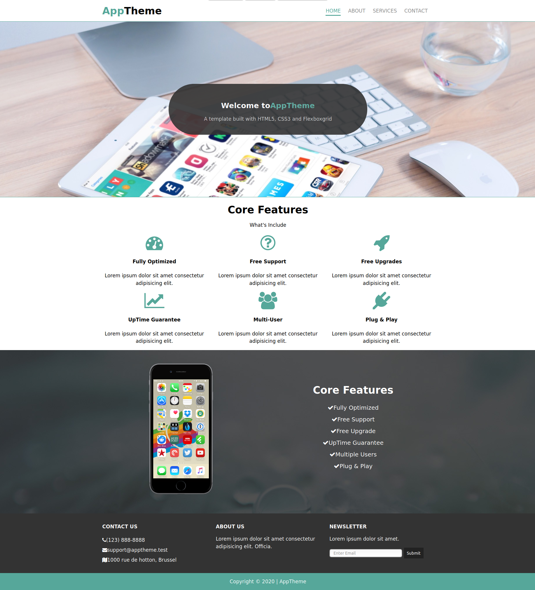

# app-theme

 This is a Front-End project to build A responsive HTML & CSS Template With FlexboxGrid.
This project has been developed using the _development strategy_ concept with one branch per step.
It is a wy to practice git workflow skills using  _Git Workflow for Two_.
This project provided by Traversy Media.

## Table of contents
* [General info](#general-info)
* [Screenshots](#screenshots)
* [Technologies](#technologies)
* [Setup](#setup)
* [Features](#features)
* [Status](#status)
* [Inspiration](#inspiration)
* [Contact](#contact)

## General info
 - This project is a simple way to practice incremental development using git, github, html and css and FlexboxGrid.
- The purpose is to use  _Git Workflow for Two_ for more practicing.
- For absolute beginner .
- Consist of 4 pages HOME ABOUT SERVICES and CONTACT
> This project use [w3-validation-template](https://github.com/HackYourFutureBelgium/w3-validation-template)

## Screenshots

## Technologies
* HTML5
* CSS3
* Flexboxgrid library
* Git & Github

## Setup
There are several ways to run this run this project. one of them is to install Live Server extension in VS Code.

## Code Examples
Examples of usage:

            `<li><i class="fa fa-check"></i>Fully Optimized</li>
             <li><i class="fa fa-check"></i>Free Support</li>`

## Features
List of features :

* Responsive
* Applying Incremental Development 
* Flexible

To-do list:
* Add some interactivity using javascript
* Improve the performance

## Status
Project is: _first phase finished_

## Inspiration
Project inspired by  Traversy Media

## Contact
Created by [@eltayeb](https://github.com/Eltayeb-Elgaali) - feel free to contact me!
